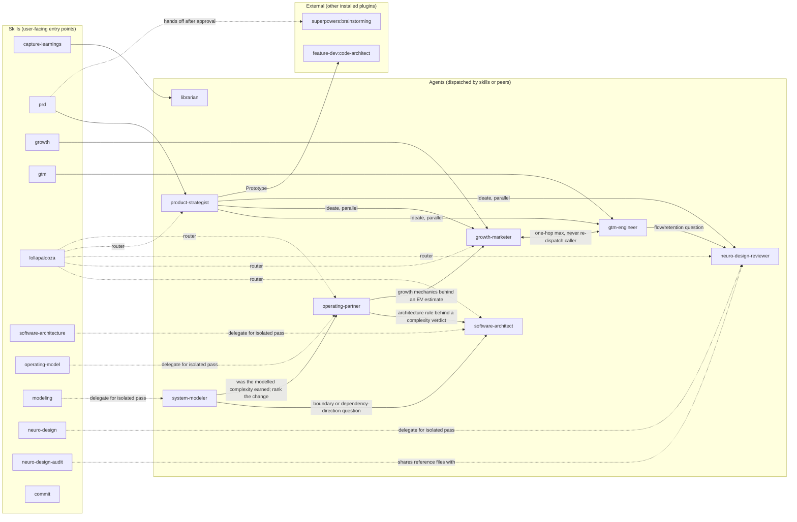

# Architecture

How this plugin's skills and agents dispatch each other, and the shared pattern the
review/audit-shaped ones use to iterate toward a converged result.

## Dispatch graph

Every peer-dispatch edge below runs synchronously (`run_in_background: false`), report-only,
one hop at a time (a subagent never re-dispatches whoever dispatched it), under a shared
depth cap of 5 nested dispatches. These rules are stated per-agent in each file; they apply
uniformly to every edge in this graph, so they're stated once here instead of once per file.

**Terminal nodes** — no outgoing peer-dispatch of their own: `software-architect`,
`neuro-design-reviewer`, `librarian`.

**The one non-obvious edge**: `growth-marketer` and `gtm-engineer` dispatch each other —
`growth-marketer` treats `gtm-engineer` as its "primary chain" for build work; `gtm-engineer`
dispatches `growth-marketer` for a strategy pass before building. This isn't a clean DAG edge.
It stays safe only because both files independently state the same two rules (one hop is the
norm; never re-dispatch whoever dispatched you) — this doc is where that mutual relationship
is visible in one place instead of split across two files' prose.

The second non-obvious edge is a **suppression** rather than a dispatch: `operating-partner`
peer-dispatches `software-architect` and `growth-marketer`, and `lollapalooza` routes to all three
independently. When `lollapalooza` dispatches `operating-partner` as its capital-allocation lens,
`operating-partner` suppresses both of its own edges and says so in its report — otherwise the two
lenses `lollapalooza` believes are independent would partly be echoes of each other. This is the
same double-counting problem `product-strategist`'s Ideate step has, solved from the opposite side:
`product-strategist` lets the caller de-duplicate, `operating-partner` de-duplicates itself.

`system-modeler` adds two more edges of the same kind and resolves them the same way: it shows the
shape and hands the judgement to `software-architect` (is this boundary right?) or
`operating-partner` (was this complexity earned, and how does the change rank?), and when either of
them dispatched it, it returns the model instead of dispatching back.

`commit` has no outgoing edges — it's fully self-contained.

## The loop-until-converged pattern

Eight skills/agents in this plugin do review, audit, reduction, or traceability work where a
single pass isn't always the end of the story: findings come back, some get fixed, and the fix should be re-checked
rather than taken on faith. Each uses the same four-step shape (the same shape
`superpowers:subagent-driven-development`'s fix-loop already uses for reviewing implementation
tasks, generalized here to a skill/agent looping on its own output):

1. **Round counter** starts at 1.
2. **Convergence check** — adopter-specific (see below). If met, stop and report success.
3. **If not met and round < cap** — take the round's action (adopter-specific: apply an
   approved fix, dispatch one more lens, etc.), increment the round, return to step 2.
4. **At the cap** — do not force a false convergence. Report the residual — what's still
   open, and why — and let the user decide what happens next. Never claim a clean result when
   the cap was hit with issues still open.

Each adopter states only its own convergence condition, cap, and per-round action, and points
back to this section — the four-step shape itself isn't restated per adopter.

### Adopters

| Adopter | Convergence | Cap | Per-round action |
| --- | --- | --- | --- |
| `neuro-design-audit` skill | No lens scored `Blocking` remains | 3 rounds | Apply approved fixes for current `Blocking` findings, re-run the six-lens audit |
| `software-architect` agent (review mode) | No rule verdict is `real gap` (only `compliant`/`premature` remain) | 3 rounds | Scaffold the approved fix for current `real gap` findings, re-review against the same rule set |
| `capture-learnings` skill (lint mode) | `node .claude/memory/check.mjs` exits 0 and no unresolved contradiction/stale-claim/orphan/dangling-link remains | 3 rounds | Apply approved fixes, re-run the full lint pass |
| `operating-model` skill (reduction loop) | Every surviving complication has a written justification from the "What counts as proof" list, and the last removal attempt broke something real | 3 rounds | Strip the single least-justified complication, check what actually breaks against the code or a measurement rather than intuition, then remove it or record its justification |
| `operating-partner` agent (review mode) | No verdict remains `unearned complexity` or `real gap` (only `aligned` and accepted `misapplied rigor` trade-offs) | 3 rounds | Apply the approved fixes — running the `operating-model` reduction loop for the complexity findings — then re-review against every applicable principle, re-establishing the maturity column if the fix moved it |
| `modeling` skill (traceability loop) | Every model element traces to a stated requirement or question, **and** every stated requirement appears in at least one view — both directions | 3 rounds | List the orphans in both directions, delete elements nothing requires, add the minimum for unmodelled requirements, re-check |
| `system-modeler` agent (modeling mode) | Same bidirectional traceability, over the model set it just produced | 3 rounds | Same per-round action, then re-emit and re-validate the affected diagrams |
| `lollapalooza` skill (Step 3) | Two or more independent lenses agree, or every applicable lens from the lens-mapping table has been dispatched | Bounded by the lens-mapping table itself (5 agent lenses plus the two gap-discipline entries) rather than a separate number | Dispatch the next applicable undispatched lens, re-run the synthesis |
