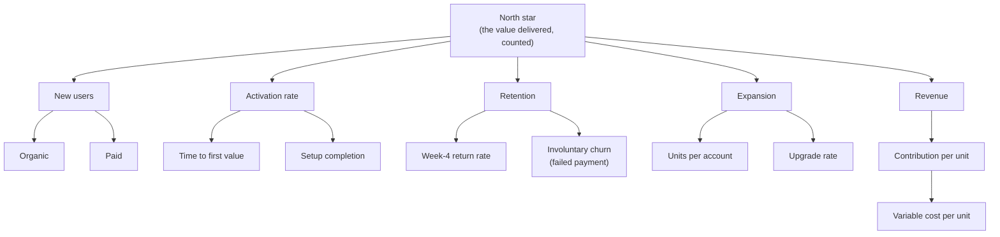

# Metrics tree: <product>

> Date: <YYYY-MM-DD> · Owner: <name>

One page connecting the number a piece of work moves to the number the business runs on. Its
purpose is to make "this improves engagement" checkable: either the path from that metric to money
exists, or the claim doesn't.

## The tree

Replace every node with your own. The tree is only useful if each edge is an arithmetic or causal
claim you'd defend.

## Definitions

| Metric | Exact definition | Source | Current | Target | Owner |
| --- | --- | --- | --- | --- | --- |
| North star | | | | | |

The **exact definition** column is the one that matters: "active user" means nothing until it says
which action, in which window, deduplicated how. Two people using the same word for different
queries is the most common measurement failure there is.

## The north star

One metric that counts **value delivered to users**, not value extracted from them. Revenue is the
result; the north star is the leading behavior that produces it. Test: if this number doubled and
revenue didn't follow within a plausible lag, the choice is wrong.

## Guardrails

The metrics that must not get worse while the others improve: latency, error rate, support volume,
refund rate, unsubscribes, churn by tenure. Every experiment inherits these
(`operating-model`'s `${CLAUDE_PLUGIN_ROOT}/skills/operating-model/references/evidence-and-experimentation.md`).

## Segments

Which cuts you always read: platform, geography, plan, tenure, usage decile. Decided in advance so
the flattering cut can't be found after the fact. State whether usage is heavy-tailed — it almost
always is, and if it is, the average is not a design input.

## Known proxy risks

For each proxy metric: what it stands for, and how it would detach under optimization pressure
(Goodhart). The mitigation is usually a guardrail plus a periodic re-validation against the thing
it proxies.
