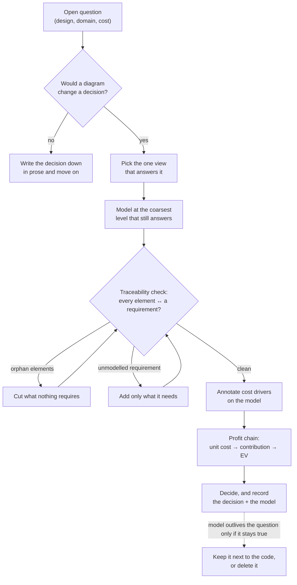

# Modeling

Modeling is how a design gets argued with before it gets built. This desk covers the parts of UML
that survive contact with real work, the rule for choosing between them, and the step almost every
modeling guide omits: **carrying the model through to money**, so that a design choice can be
stated as a change in cost or contribution per transaction rather than as a matter of taste.

Two commitments run through it. **A diagram is a complication** and takes the same burden of proof
as any other (`operating-model`): it earns its place by answering a question someone actually has,
and a model nobody consults is documentation debt with a rendering step. And **every model is
partial by design** — you pick the view that answers the question, not the set that describes
everything.

## When to use

- Designing a system, a service, or a feature whose shape isn't obvious, before code exists.
- Modeling a domain: what the entities are, what they own, what states they move through.
- Explaining an existing system to someone — including your future self, or an agent.
- Deciding which diagram (if any) answers the question in front of you.
- Working out what a design costs per transaction and what it earns — the profit chain below.

Not for: a change whose shape is already clear, or a system small enough that the code is a
faster read than the model. Drawing a class diagram of three structs is the modeling version of
premature abstraction.

## The five questions, and the view that answers each

UML defines fourteen diagram types. Six answer questions that actually come up; the rest are
specialist tools you can reach for when the specific need arises, not defaults.

| The question you actually have | View | Notation |
| --- | --- | --- |
| Who wants what from this system, and where are the boundaries? | **Use case** | Actors, use cases, system boundary — `references/behavioral-views.md` |
| What are the things, what do they own, how do they relate? | **Domain / class** | Classes, associations, multiplicity, composition — `references/structural-views.md` |
| What happens, in what order, across which participants? | **Sequence** | Lifelines, messages, activations, fragments — `references/behavioral-views.md` |
| What states can this thing be in, and what moves it? | **State machine** | States, transitions, guards, entry/exit — `references/behavioral-views.md` |
| What are the deployable pieces and their contracts? | **Component** | Components, provided/required interfaces — `references/structural-views.md` |
| What runs where, on what, at what cost? | **Deployment** | Nodes, artifacts, communication paths — `references/structural-views.md` |

The other eight (object, package, composite structure, profile, activity, communication,
interaction overview, timing) are covered in the reference files where they earn a mention —
activity in particular is worth knowing for operational flows, and package for module structure.

**One question, one diagram.** A diagram that answers two questions answers neither well, and a
"complete" model of a system that has no open questions is the most expensive documentation you
can produce.

## The modeling flow

## The profit chain

The step that turns modeling from a drawing exercise into an operating instrument. Each view
contributes a different term of the unit economics; `references/profit-modeling.md` carries the
full method and a worked example.

| View | What it tells you about money |
| --- | --- |
| Use case | **The unit.** What the user is buying one of — the transaction that gets priced and counted |
| Sequence | **Variable cost per unit.** Every message is a call, a query, a byte, a token, a third-party charge |
| Deployment | **Fixed cost and the scaling term.** What runs regardless of volume, and what grows with it |
| Domain / class | **The value metric candidates.** What is countable, and which count actually tracks value received |
| State machine | **Lifecycle economics.** The transitions that are activation, expansion, churn, and refund |
| Activity | **Operational cost.** Every manual step is support time with a rate attached |

From those: **contribution per unit = price − variable cost per unit**, and an engineering change
is worth *Δcontribution × volume − cost to build*, ranked against the alternatives per
`operating-model`'s `${CLAUDE_PLUGIN_ROOT}/skills/operating-model/references/impact-and-prioritization.md`.

## The traceability loop

A model drifts from the system in one direction (elements nobody requires) and from the
requirements in the other (requirements nothing models). This adopts the shared
loop-until-converged pattern in `../../docs/architecture.md`:

- **Convergence** — every element in the model traces to a stated requirement or question, and
  every stated requirement appears in at least one view. Both directions, or it isn't converged.
- **Cap** — 3 rounds.
- **Per round** — list the orphans in both directions; delete the elements nothing requires, add
  the minimum needed for the unmodelled requirements, then re-check. Never widen the model to
  "look complete"; an element added for symmetry is an orphan wearing a suit.
- **At the cap** — report what's still untraced rather than declaring the model complete. An
  untraced element is a design decision nobody made on purpose.

## The references

- **UML core concepts** — the pillars beneath the notation: abstraction and encapsulation, the six
  relationship kinds and when each is a lie, multiplicity, stereotypes and profiles, the 4+1 view
  model, and the CIM/PIM/PSM levels of abstraction. `references/uml-core-concepts.md`
- **Structural views** — class/domain, object, package, component, composite structure, and
  deployment; aggregate boundaries, ownership, and how structure maps onto Go packages and a
  Vite/React tree. `references/structural-views.md`
- **Behavioral views** — use case, sequence, activity, state machine, and communication; when each
  is the right instrument, and the failure modes of each. `references/behavioral-views.md`
- **Profit modeling** — the full method for carrying a model through to unit economics, cost-driver
  annotation, the contribution calculation, and a worked example with numbers.
  `references/profit-modeling.md`
- **Mermaid cookbook** — every diagram type in this desk as a working mermaid snippet, since that's
  what renders in this repo, in a PR, and in an artifact. Every snippet in the file is
  parser-validated. `references/mermaid-cookbook.md`

Project-level blueprints that these models feed — system design, ADRs, API and data guides, PRDs,
metrics trees, pricing worksheets — live under `docs/engineering/` and `docs/product/`.

## How this fits the rest of the plugin

- `software-architecture` decides the shape (layers, boundaries, scaling triggers); this desk
  *renders and tests* that shape, and prices it.
- `operating-model` sets whether the complexity in the model was earned and ranks the change by
  expected value; the profit chain is the input it needs.
- `prd` and the product desk own the problem definition; use case and state-machine views are how
  a PRD's requirements become checkable.
- `commit` and `capture-learnings` are where a model that survived its question gets recorded.

## Related agent

`agents/system-modeler.md` produces or reviews a full model set for a system or feature, runs the
traceability loop, and returns the profit chain with its assumptions named. Use it for a complete
pass; use the reference files directly while you're modeling something yourself.
