# Mermaid cookbook

Mermaid is the notation this plugin actually uses, because it renders where the work happens — a
repo file, a pull request, an artifact — and because a diagram that lives in text is diffable,
reviewable, and fails visibly when it stops parsing. Everything below is a working snippet;
`scripts/check-plugin.mjs`'s sibling checks and the repo's own validation keep them parseable.

Two conventions worth adopting before the snippets: **quote any label containing punctuation**
(`A["Order (paid)"]`), and **keep node ids short and stable** — ids are what diffs compare, labels
are what humans read.

## Use case

Mermaid has no native use-case notation. The idiom that carries the same information: actors
outside, a subgraph as the system boundary, verb-phrase goals inside.

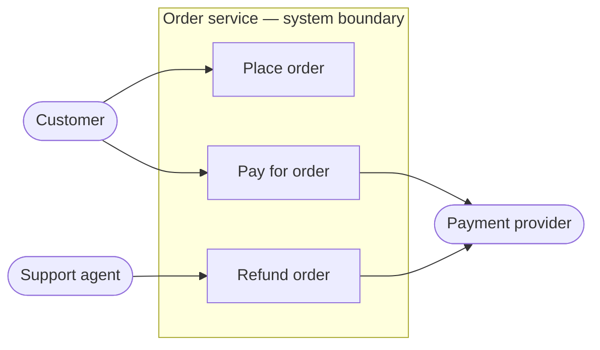
```mermaid
graph LR
  customer(["Customer"])
  agent(["Support agent"])
  psp(["Payment provider"])
  subgraph System["Order service — system boundary"]
    place["Place order"]
    pay["Pay for order"]
    refund["Refund order"]
  end
  customer --> place
  customer --> pay
  agent --> refund
  pay --> psp
  refund --> psp
```

## Domain / class

Multiplicities and composition are the point; note the `*--` (composition) versus `-->`
(association), and the note carrying an invariant.

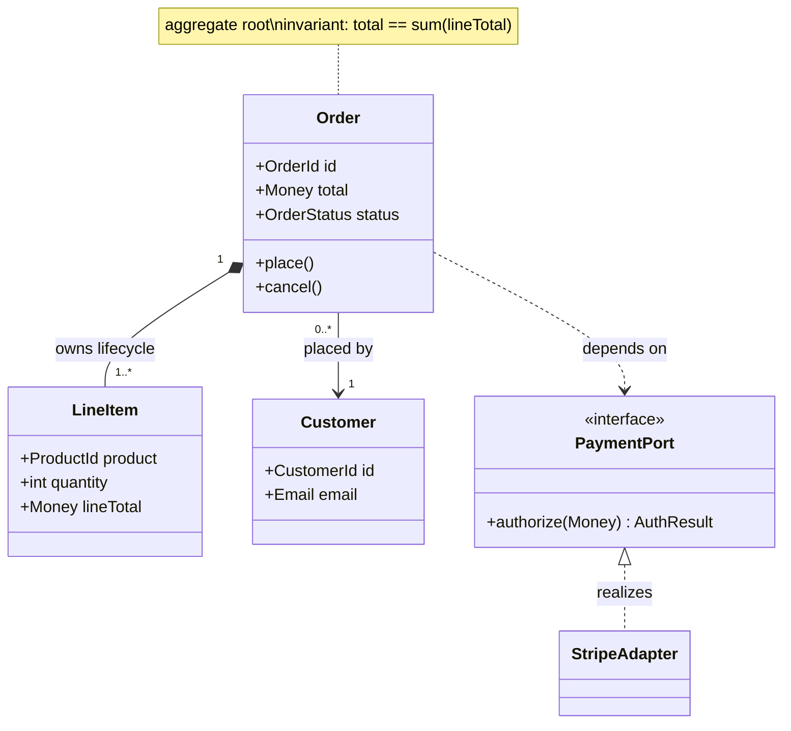
```mermaid
classDiagram
  class Order {
    +OrderId id
    +Money total
    +OrderStatus status
    +place()
    +cancel()
  }
  class LineItem {
    +ProductId product
    +int quantity
    +Money lineTotal
  }
  class Customer {
    +CustomerId id
    +Email email
  }
  class PaymentPort {
    <<interface>>
    +authorize(Money) AuthResult
  }
  class StripeAdapter

  Order "1" *-- "1..*" LineItem : owns lifecycle
  Order "0..*" --> "1" Customer : placed by
  PaymentPort <|.. StripeAdapter : realizes
  Order ..> PaymentPort : depends on
  note for Order "aggregate root\ninvariant: total == sum(lineTotal)"
```

## Sequence

Activations, an `alt` for the failure path, and cost annotations on the expensive messages.

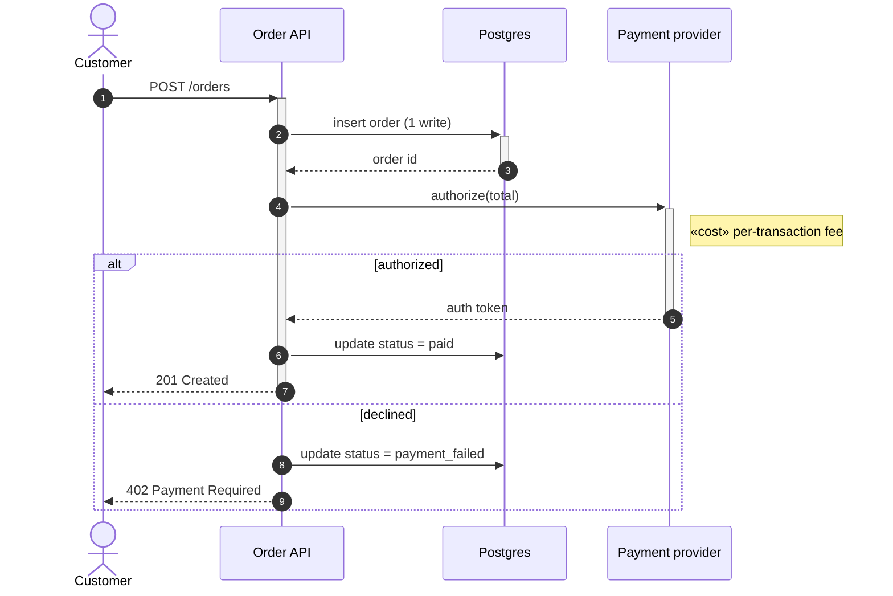
```mermaid
sequenceDiagram
  autonumber
  actor U as Customer
  participant API as Order API
  participant DB as Postgres
  participant PSP as Payment provider

  U->>+API: POST /orders
  API->>+DB: insert order (1 write)
  DB-->>-API: order id
  API->>+PSP: authorize(total)
  Note right of PSP: «cost» per-transaction fee
  alt authorized
    PSP-->>-API: auth token
    API->>DB: update status = paid
    API-->>-U: 201 Created
  else declined
    API->>DB: update status = payment_failed
    API-->>U: 402 Payment Required
  end
```

## State machine

Guards, timeouts as first-class transitions, and terminal states named on purpose.

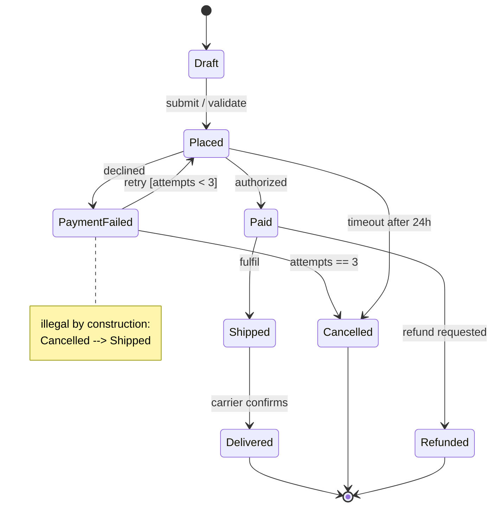
```mermaid
stateDiagram-v2
  [*] --> Draft
  Draft --> Placed: submit / validate
  Placed --> Paid: authorized
  Placed --> PaymentFailed: declined
  PaymentFailed --> Placed: retry [attempts < 3]
  PaymentFailed --> Cancelled: attempts == 3
  Placed --> Cancelled: timeout after 24h
  Paid --> Shipped: fulfil
  Paid --> Refunded: refund requested
  Shipped --> Delivered: carrier confirms
  Delivered --> [*]
  Cancelled --> [*]
  Refunded --> [*]
  note right of PaymentFailed
    illegal by construction:
    Cancelled --> Shipped
  end note
```

## Activity with swimlanes

Mermaid has no true swimlanes; subgraphs are the idiom, and the point is to see which lane is
human — that lane is your operational cost.

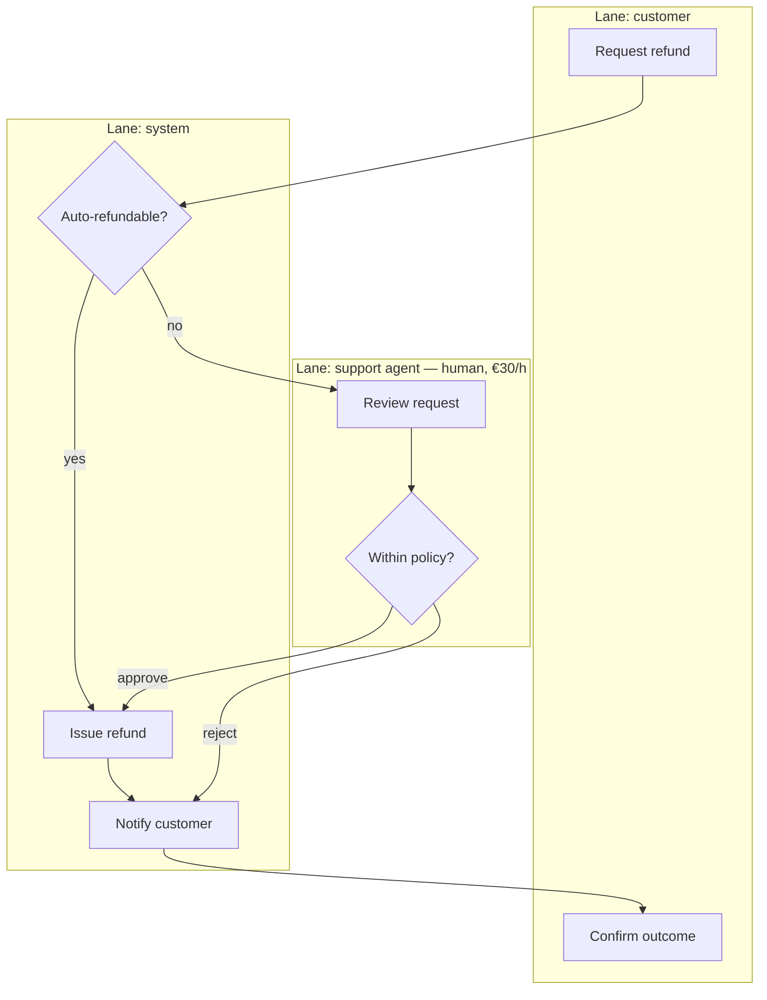
```mermaid
flowchart TD
  subgraph Customer["Lane: customer"]
    req["Request refund"]
    confirm["Confirm outcome"]
  end
  subgraph Agent["Lane: support agent — human, €30/h"]
    review["Review request"]
    decide{"Within policy?"}
  end
  subgraph Sys["Lane: system"]
    auto{"Auto-refundable?"}
    issue["Issue refund"]
    notify["Notify customer"]
  end
  req --> auto
  auto -->|yes| issue
  auto -->|no| review
  review --> decide
  decide -->|approve| issue
  decide -->|reject| notify
  issue --> notify
  notify --> confirm
```

## Component

Provided and required interfaces, with third parties marked.

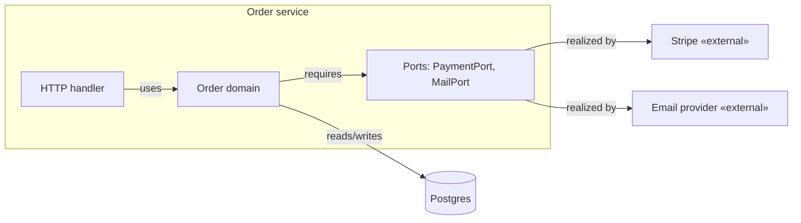
```mermaid
flowchart LR
  subgraph app["Order service"]
    http["HTTP handler"]
    domain["Order domain"]
    ports["Ports: PaymentPort, MailPort"]
  end
  stripe["Stripe «external»"]
  ses["Email provider «external»"]
  db[("Postgres")]

  http -->|uses| domain
  domain -->|requires| ports
  ports -->|realized by| stripe
  ports -->|realized by| ses
  domain -->|reads/writes| db
```

## Deployment, with cost annotations

The structural view that carries money. Mark each node fixed, variable, or stepped.

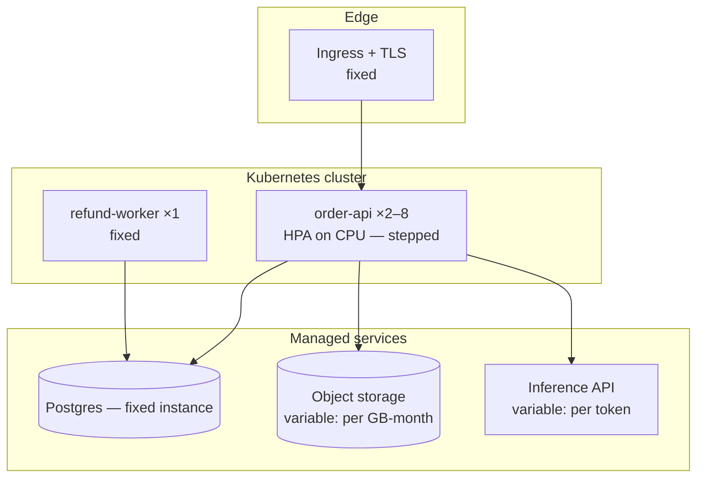
```mermaid
flowchart TB
  subgraph edge["Edge"]
    lb["Ingress + TLS<br/>fixed"]
  end
  subgraph cluster["Kubernetes cluster"]
    api["order-api ×2–8<br/>HPA on CPU — stepped"]
    worker["refund-worker ×1<br/>fixed"]
  end
  subgraph managed["Managed services"]
    pg[("Postgres — fixed instance")]
    obj[("Object storage<br/>variable: per GB-month")]
    llm["Inference API<br/>variable: per token"]
  end
  lb --> api
  api --> pg
  api --> obj
  api --> llm
  worker --> pg
```

## Data model

`erDiagram` is the fastest way to argue about a schema, and it states cardinality in the notation.

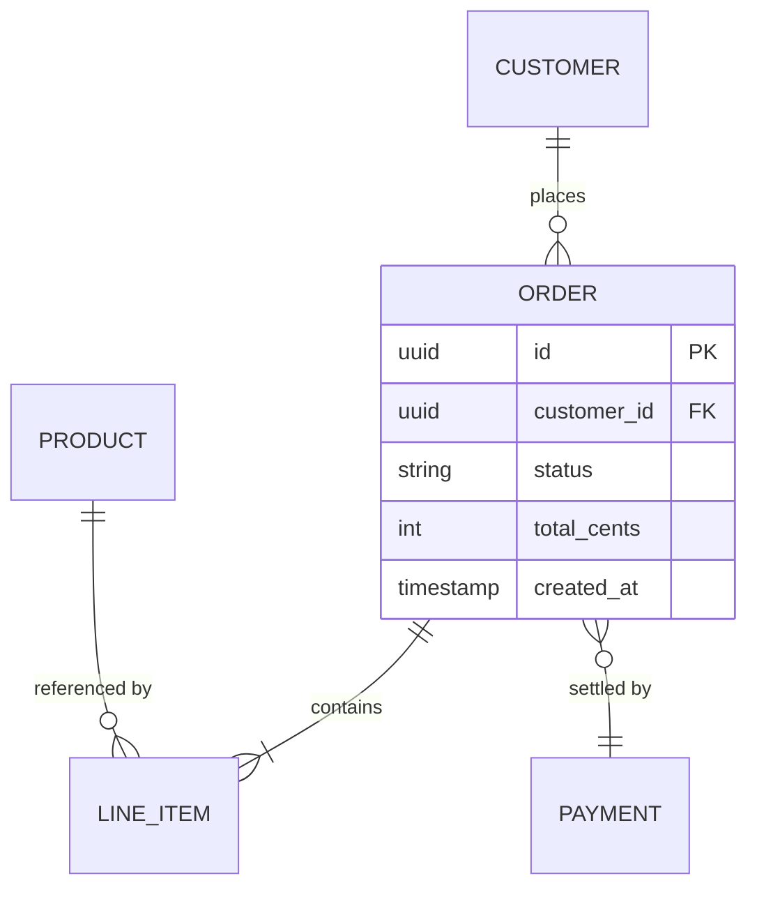
```mermaid
erDiagram
  CUSTOMER ||--o{ ORDER : places
  ORDER ||--|{ LINE_ITEM : contains
  ORDER }o--|| PAYMENT : "settled by"
  PRODUCT ||--o{ LINE_ITEM : "referenced by"
  ORDER {
    uuid id PK
    uuid customer_id FK
    string status
    int total_cents
    timestamp created_at
  }
```

## C4 context and container

The cheapest way to onboard someone. Two levels, then stop.

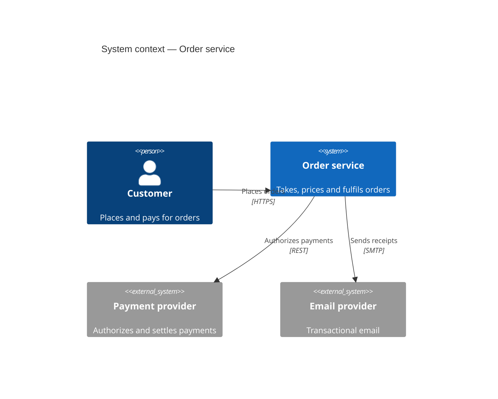
```mermaid
C4Context
  title System context — Order service
  Person(customer, "Customer", "Places and pays for orders")
  System(order, "Order service", "Takes, prices and fulfils orders")
  System_Ext(psp, "Payment provider", "Authorizes and settles payments")
  System_Ext(mail, "Email provider", "Transactional email")
  Rel(customer, order, "Places orders", "HTTPS")
  Rel(order, psp, "Authorizes payments", "REST")
  Rel(order, mail, "Sends receipts", "SMTP")
```

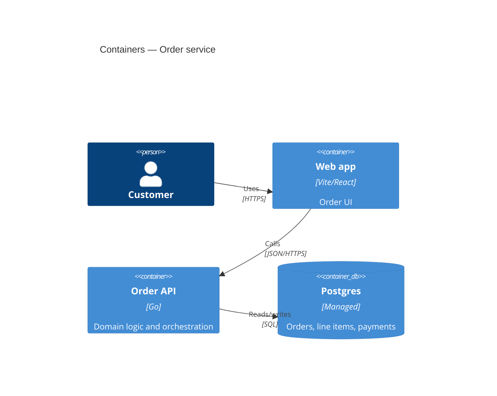
```mermaid
C4Container
  title Containers — Order service
  Person(customer, "Customer")
  Container(spa, "Web app", "Vite/React", "Order UI")
  Container(api, "Order API", "Go", "Domain logic and orchestration")
  ContainerDb(db, "Postgres", "Managed", "Orders, line items, payments")
  Rel(customer, spa, "Uses", "HTTPS")
  Rel(spa, api, "Calls", "JSON/HTTPS")
  Rel(api, db, "Reads/writes", "SQL")
```

## Requirements and traceability

The one diagram that makes the traceability loop mechanical rather than a promise.

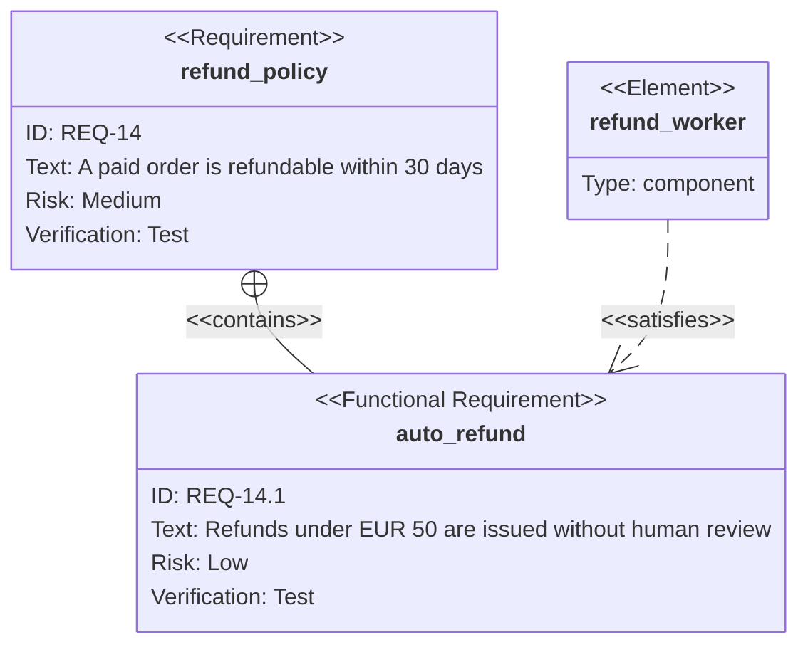
```mermaid
requirementDiagram
  requirement refund_policy {
    id: "REQ-14"
    text: "A paid order is refundable within 30 days"
    risk: medium
    verifymethod: test
  }
  functionalRequirement auto_refund {
    id: "REQ-14.1"
    text: "Refunds under EUR 50 are issued without human review"
    risk: low
    verifymethod: test
  }
  element refund_worker {
    type: "component"
  }
  refund_policy - contains -> auto_refund
  refund_worker - satisfies -> auto_refund
```

## Cost and value flow

A Sankey makes the dominant cost driver impossible to miss — the whole point of step 4 in
`profit-modeling.md`.

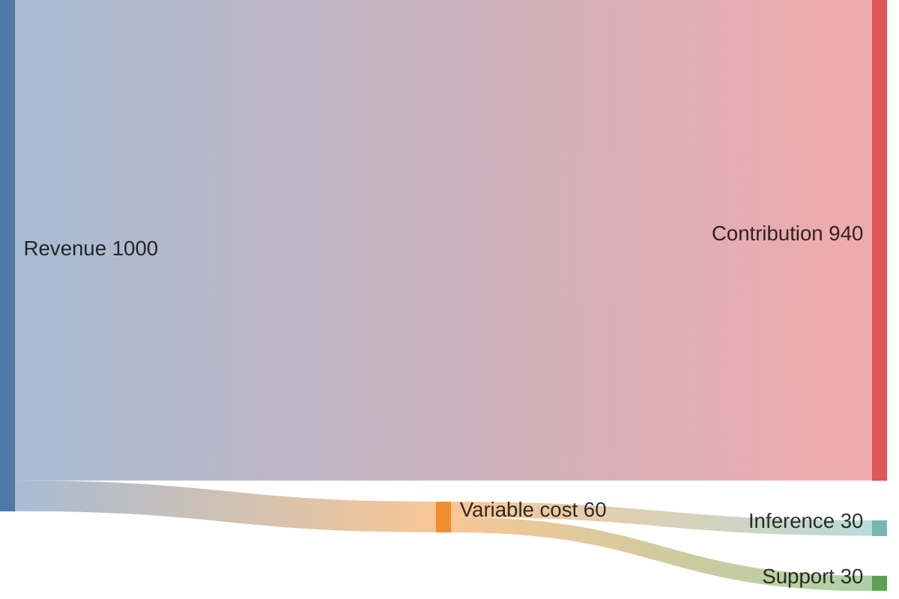
```mermaid
sankey-beta
Revenue,Variable cost,60
Revenue,Contribution,940
Variable cost,Inference,30
Variable cost,Support,30
```

## Product-side diagrams

Useful in a PRD or a strategy doc, where a picture of the decision beats a paragraph about it.

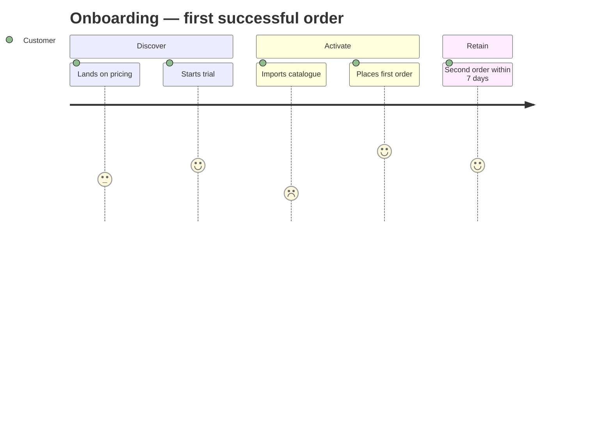
```mermaid
journey
  title Onboarding — first successful order
  section Discover
    Lands on pricing: 3: Customer
    Starts trial: 4: Customer
  section Activate
    Imports catalogue: 2: Customer
    Places first order: 5: Customer
  section Retain
    Second order within 7 days: 4: Customer
```

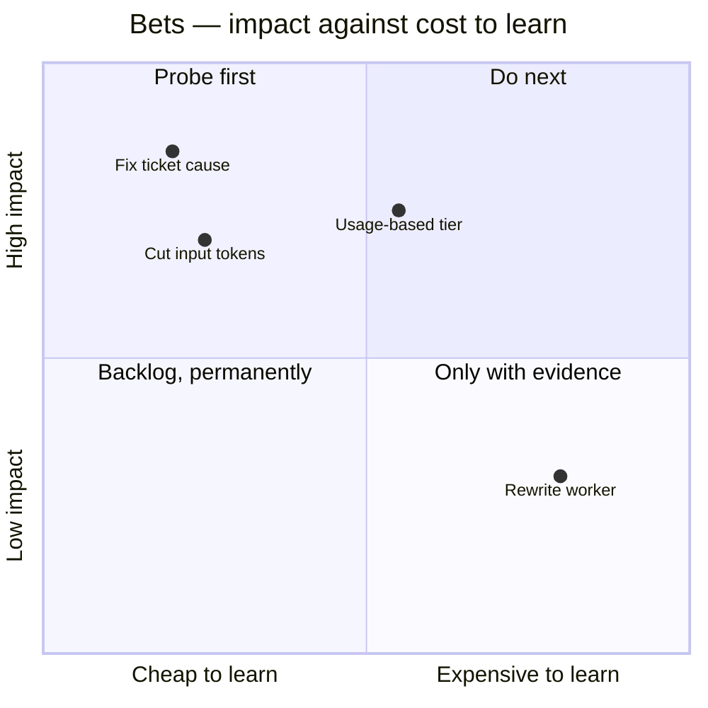
```mermaid
quadrantChart
  title Bets — impact against cost to learn
  x-axis "Cheap to learn" --> "Expensive to learn"
  y-axis "Low impact" --> "High impact"
  quadrant-1 "Do next"
  quadrant-2 "Probe first"
  quadrant-3 "Backlog, permanently"
  quadrant-4 "Only with evidence"
  "Cut input tokens": [0.25, 0.7]
  "Fix ticket cause": [0.2, 0.85]
  "Rewrite worker": [0.8, 0.3]
  "Usage-based tier": [0.55, 0.75]
```

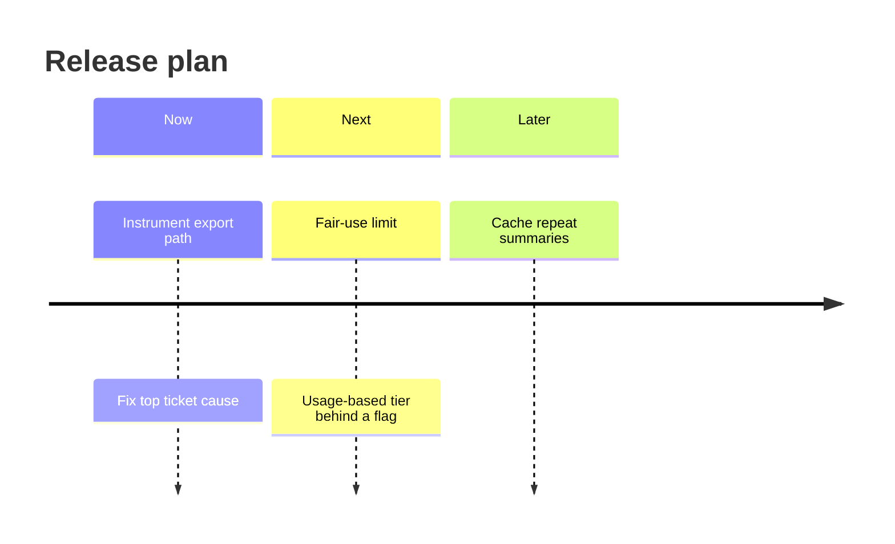
```mermaid
timeline
  title Release plan
  section Now
    Instrument export path : Fix top ticket cause
  section Next
    Fair-use limit : Usage-based tier behind a flag
  section Later
    Cache repeat summaries
```

## What to reach for

| You need to show | Mermaid |
| --- | --- |
| Scope and actors | `graph` with a system subgraph |
| Concepts, ownership, invariants | `classDiagram` |
| A schema | `erDiagram` |
| Order of operations, failure paths, cost | `sequenceDiagram` |
| Lifecycle and illegal transitions | `stateDiagram-v2` |
| Who does each step | `flowchart` with lane subgraphs |
| Systems at a glance | `C4Context` / `C4Container` |
| Requirement → element traceability | `requirementDiagram` |
| Where cost or value goes | `sankey-beta` |
| A prioritization argument | `quadrantChart` |
| A plan over time | `timeline` |
