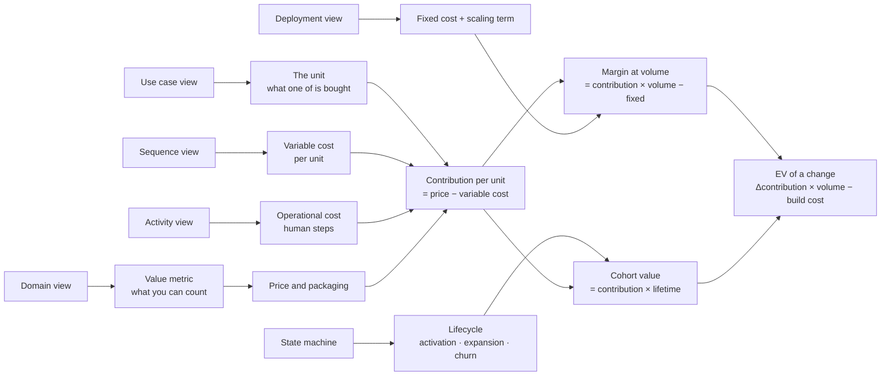

# Profit modeling

The step that turns a model into an operating instrument: carrying it through to money, so that a
design choice can be stated as a change in cost or contribution per unit rather than as a
preference. It's the same models from the other reference files, annotated with what each element
costs and earns.

The claim: **an engineering decision you can't express as a change in unit economics is a decision
you're making on aesthetics.** Often that's fine — most decisions are too small to price. But for
anything that touches a per-transaction path, the arithmetic exists and is usually not hard, and
nobody does it.

## The chain

## Step 1 — name the unit

From the use case view. The unit is what a user is buying one of: a summary generated, a file
transferred, a seat-month, an API call, a booking. Two tests:

- **It's countable in the system today**, or one instrumentation change away.
- **Its count tracks value received.** Seats track value in a collaboration tool and not in a
  batch-processing one; API calls track value for an integration product and not for a UI-first
  one. This is the value-metric question from `operating-model`'s
  `${CLAUDE_PLUGIN_ROOT}/skills/operating-model/references/pricing-and-value-capture.md`, and the domain model is where the candidates come
  from.

If the unit and the price are on different bases — priced per seat, cost driven by documents
processed — say so immediately. Every unit-economics surprise in software comes from that gap.

## Step 2 — cost the unit from the sequence diagram

Walk one transaction message by message, and write the cost of each. The categories that actually
matter:

| Category | What to read off the model | Typical unit |
| --- | --- | --- |
| Third-party API | Every message crossing to an `«external»` participant | Per call, per token, per transaction + % |
| Model inference | Input and output size on the LLM call | Per million tokens, input and output priced separately |
| Compute | Handler duration × the instance's rate | vCPU-second or request-second |
| Database | Query count, rows scanned, IOPS, connection time | Per read/write unit, or a share of the instance |
| Storage | Bytes written × retention | Per GB-month |
| Egress | Response payload size × the boundary it crosses | Per GB |
| Support | Ticket rate for this flow × handle time | Minutes × loaded hourly rate |

Two disciplines make the number trustworthy: **rate from the provider's current price list, never
from memory** (they change, and inference pricing changes fastest), and **volume from your own
instrumentation, or labelled as an assumption**. Rates are risk; volumes are usually Knightian
uncertainty (`operating-model`'s `${CLAUDE_PLUGIN_ROOT}/skills/operating-model/references/foundations/uncertainty-and-information.md`) — mark
which is which, because only one of them is a fact.

Annotate the diagram itself with a `«cost»` stereotype on the expensive messages. A sequence
diagram where the reader's eye lands on the three messages that cost money is worth more than a
spreadsheet nobody opens.

## Step 3 — separate fixed from variable, from the deployment view

Every node is one of three things, and the distinction decides everything downstream:

- **Fixed**: runs at zero volume — a database instance, a minimum replica count, a monitoring bill,
  a domain, a base plan. Doesn't enter contribution; sets the break-even volume.
- **Variable**: scales with the unit — inference, egress, per-request compute, per-transaction
  fees. This is the number in contribution.
- **Stepped**: fixed until a threshold, then a jump — an extra replica, a bigger instance, the next
  pricing tier of a SaaS dependency. Model it as fixed with the step named, and note where the
  step lands: a design that pushes the step further out is worth exactly the deferred cost.

The most valuable design moves usually convert one category into another. A cache converts variable
inference cost into fixed memory. A queue converts peak capacity (fixed, sized for the spike) into
average capacity plus latency. Batching converts per-call overhead into per-item cost. **Naming the
conversion is the argument** — much better than "it'll be faster".

## Step 4 — contribution, break-even, and the dominant driver

- **Contribution per unit** = price per unit − variable cost per unit.
- **Break-even volume** = fixed cost ÷ contribution per unit.
- **Margin at volume V** = contribution × V − fixed.
- **Cohort value** = contribution per unit × units per period × expected lifetime, where lifetime
  comes from the churn transitions in the state machine.

Then rank the cost drivers and **only optimize the dominant one**. If inference is 78% of variable
cost, a 30% saving on compute changes nothing you can measure; halving the token count changes the
business. This is the modeling version of Amdahl's law, and it's the single most common place where
engineering effort is spent where it can't matter.

## Step 5 — price the change

For a proposed engineering change: **EV ≈ Δcontribution × expected volume − cost to build**, ranked
against the alternatives per `operating-model`'s `${CLAUDE_PLUGIN_ROOT}/skills/operating-model/references/impact-and-prioritization.md`. State
the assumption behind the volume, and set the kill criterion — the measured Δ below which the work
stops — before starting.

## Worked example: an AI summary feature

*A €19/month SaaS adds "summarize this document". Rates below are illustrative placeholders —
substitute the provider's current published prices; inference pricing in particular changes often
enough that any number written in a file is stale.*

**Unit:** one summary generated. **Value metric candidate:** summaries per month (tracks value);
seats (doesn't — one user can generate hundreds).

**From the sequence diagram**, per summary: 1 inference call (≈6,000 input tokens, ≈800 output),
3 database queries, 1 object-storage write of ≈200 KB, ≈400 ms of handler time, and a 1% chance of
a support ticket at 6 minutes.

| Driver | Arithmetic (illustrative rates) | Per summary | Share |
| --- | --- | --- | --- |
| Inference — input | 6,000 tok × €3/M | €0.018 | 30% |
| Inference — output | 800 tok × €15/M | €0.012 | 20% |
| Support | 1% × 6 min × €30/h (€3.00 per ticket) | €0.030 | 50% |
| Compute | 0.4 s × €0.04/vCPU-h | €0.0000044 | ~0% |
| Storage | 200 KB × €0.02/GB-month | €0.000004 | ~0% |
| **Variable cost** | | **≈ €0.060** | |

**What the model just told you**, none of which was obvious before the arithmetic:

1. **Support is the largest single driver** — half the unit cost — and it isn't in anybody's
   infrastructure budget. The highest-value engineering work here is whatever removes the ticket
   cause (per the activity view: which human step is being triggered, and by what confusion).
2. **Compute and storage are noise.** Optimizing them is effort spent where it cannot matter.
3. **Break-even usage per subscriber:** €19 ÷ €0.060 ≈ **317 summaries/month**. Below that the
   subscriber is profitable on this feature; above it, each one costs money. Now the packaging
   question has an answer with a number in it — a fair-use limit set at a real threshold rather
   than a guess, and a heavy-user tier whose price you can derive instead of invent.
4. **The distribution matters more than the average.** If 3% of users generate 40% of summaries,
   the average is a fiction and the limit is the entire design. Read it by segment, as
   `operating-model`'s `${CLAUDE_PLUGIN_ROOT}/skills/operating-model/references/evidence-and-experimentation.md` requires.
5. **The design lever ranks itself:** cutting input tokens (truncation, retrieval instead of
   whole-document context) attacks 30%; caching repeat summaries attacks both inference terms;
   fixing the ticket cause attacks 50%. Do the third one first.

## Anti-patterns

- **Costing the average user.** Software costs are almost always heavy-tailed; the mean subscriber
  is a person who doesn't exist.
- **Ignoring support and ops.** The costs that aren't on a cloud invoice are routinely the largest,
  and always the ones nobody models.
- **Rates from memory.** Especially inference pricing. Look it up, date it in the doc.
- **Optimizing a non-dominant driver** because it's the one you know how to optimize.
- **Pricing the model instead of measuring.** This method produces a *ranking of drivers* reliably
  and an *absolute cost* only approximately. Use it to choose where to look; instrument to know.
- **Stopping at cost.** Cost without the contribution and lifetime terms tells you what to cut, not
  what to build.
