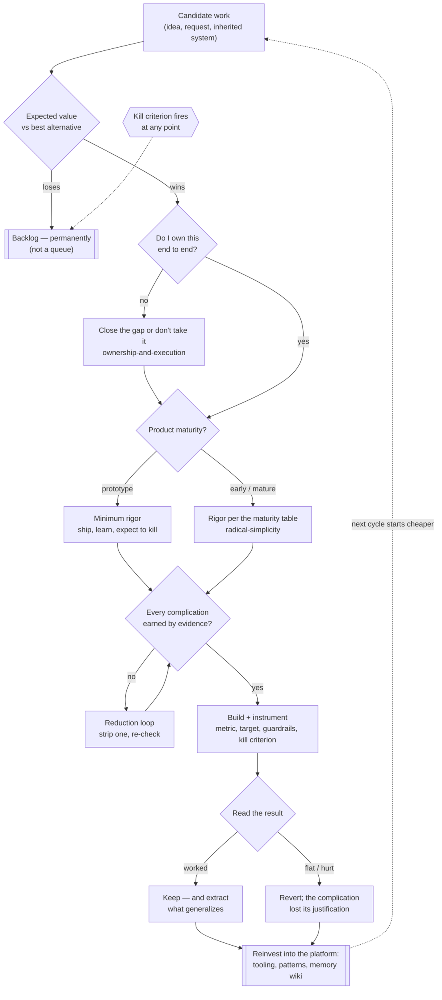

# Operating model

A distilled operating model for building and running software products at a high standard with a
small number of people: how work gets chosen, how much ceremony it earns, who owns it end to end,
what counts as evidence, and what happens to an asset you inherit rather than start. Six
self-contained reference files — read the one that matches the decision in front of you rather
than loading all six.

This is deliberately an *operating* model, not a methodology. It says nothing about ticket formats
or ceremony names. It says which complications you're allowed to buy, what you must show to buy
them, and what happens to work that can't justify itself.

## When to use

- Deciding what to work on next, or defending a decision to *not* work on something.
- Judging whether a proposed complication — a service, a queue, an abstraction, a process, a
  meeting, a test tier — has earned its place.
- Setting the level of rigor for a piece of work: how much testing, how many release stages, how
  much experimentation this product, at this maturity, actually deserves.
- Taking over a codebase, product, or system someone else built.
- Reviewing your own throughput: whether what you finished last month was the highest-expected-value
  work available at the time.

Not for a decision that's already obvious, or work small enough that reasoning about it costs more
than doing it. Applying an operating model to a two-line fix is itself a complication that hasn't
earned its place.

## The six principles, in short

Enough to act on without opening a reference file. Each is expanded in the file named after it.

1. **Radical simplicity, with the burden of proof reversed.** The simplest solution is the default
   and doesn't have to argue for itself. Every departure does — with a reason that exists today,
   not one you expect to have later.
2. **Ownership is end to end.** Whoever owns a problem owns it from the data model to the deploy
   to the interface to the number it was meant to move. Breadth across the stack, depth in one or
   two areas; a handoff at a layer boundary is a failure mode, not a structure.
3. **Impact only.** Work is chosen by expected value — not by age, promise, or who asked. Most of
   the backlog is meant to stay in the backlog permanently; that's the mechanism working.
4. **Evidence over taste.** Decisions from small tweaks to strategy get settled by measurement
   where measurement is available and honest; instrumentation ships with the feature, not after.
5. **Rigor proportional to maturity.** A prototype and a product with paying users aren't owed the
   same process. Applying mature-product ceremony to an unproven idea is as expensive as the
   reverse, and less visible.
6. **Transform what you inherit; don't restart it.** An inherited system's value is its proven
   demand, not its code. Migrate onto foundations you already run, delete what doesn't earn its
   keep, re-scope deliberately — the full rewrite is the expensive last resort.

## The operating loop

The six principles aren't a checklist; they're gates on one loop, each governing a different
moment. Where a piece of work is stuck usually names which gate it failed.

Two properties of this loop are load-bearing. **The graveyard is an output, not a failure** — most
candidates exit at the first gate and most experiments exit at the last, and both are the system
working. **The reinvestment edge is what makes it compound** — a cycle that leaves nothing reusable
behind is a sequence of unrelated tasks wearing a loop's shape.

## The reduction loop

When a design or diff has accumulated complications, don't argue them one at a time in the
abstract. Strip them, one per round, and see what actually breaks. This follows the shared
loop-until-converged pattern in `../../docs/architecture.md`:

- **Convergence** — every remaining complication has a written justification drawn from the "What
  counts as proof" list in `references/radical-simplicity.md` (a measured number you have today, a
  failure that already happened, a written requirement, or a one-way door), *and* the last removal
  attempt broke something real.
- **Cap** — 3 rounds.
- **Per round** — take the single least-justified complication, state what would break without it,
  then check that claim against the code or the measurement rather than against intuition. If
  nothing breaks, remove it and re-check the rest; if something does, record the justification
  next to it and move to the next-least-justified one.
- **At the cap** — report which complications are still unjustified rather than declaring the
  design simple. An unjustified complication that survives the cap is flagged debt, not an
  approved one.

## The six references

- **Radical simplicity** — the default-to-simple rule, what counts as proof that a complication is
  earned, the complication ledger (which evidence each standard complication requires), and the
  table of how rigor scales with product maturity. Read `references/radical-simplicity.md`.
- **Ownership and execution** — end-to-end ownership, breadth with one or two depths, the finisher
  rule, speaking up, decision rights without titles, and writing decisions down. Read
  `references/ownership-and-execution.md`.
- **Impact and prioritization** — expected-value ranking, kill criteria written in advance,
  opportunity cost, the permanent backlog, long horizon with fast pace. Read
  `references/impact-and-prioritization.md`.
- **Evidence and experimentation** — what to instrument before building, when an experiment is the
  right tool and when it isn't, reading results honestly, and lifetime-value framing for spend.
  Read `references/evidence-and-experimentation.md`.
- **Asset transformation** — the acquire → transform → reinvest loop at business scale and at
  codebase scale, migration over rewrite, and an honest account of where the playbook does damage.
  Read `references/asset-transformation.md`.
- **Talent and standards** — evaluation as measurement: the rubric written before the search,
  structured comparable signals, density over headcount, and how the same mechanics apply to
  reviewing agent-produced work. Read `references/talent-and-standards.md`.

`references/provenance.md` records where these principles come from — company documents,
engineering writing, the IPO prospectus, and outside reporting including the critical kind — so
each claim can be traced rather than taken on this file's word.

## How this fits the rest of the plugin

This skill sets the *standard*; the other desks do the specialist work under it.

- `software-architecture` decides the shape of a system; this skill decides whether that shape's
  complications were earned. Its `scaling-and-infra.md` trigger framework is the long form of the
  complication ledger.
- `prd` and `product-strategist` generate and evaluate product bets; this skill ranks them by
  expected value and writes the kill criterion.
- `growth` / `gtm` own acquisition and retention strategy; this skill fixes the standard of
  evidence they're held to and the lifetime-value frame for spend.
- `lollapalooza` treats this desk as its capital-allocation lens — expected value, opportunity
  cost, base rates, compounding.
- `capture-learnings` is the reinvestment edge of the operating loop: what generalizes goes to the
  memory wiki, or the cycle doesn't compound.
- `commit` is where the *why* behind an earned complication survives.

## Related agent

`agents/operating-partner.md` applies all six references at once to a plan, a diff, a roadmap, or
an inherited codebase and returns a verdict per principle, looping on fixes until no unearned
complexity or real gap remains. Use it for a full pass; use the reference files directly for a
single decision while you're already working.
