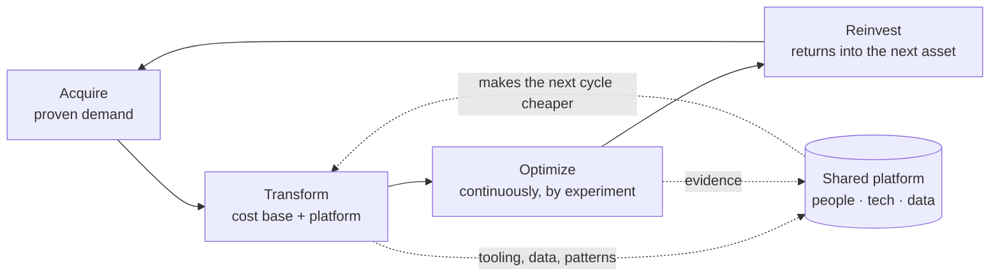

# Asset transformation

**The mechanism under this file.** Transform-don't-restart comes from two places:
`foundations/compounding-and-capital.md` (reinvested returns compound; a rewrite spends the
accumulated corrections to buy back only implementation) and
`foundations/irreversibility-and-optionality.md` (the incremental path preserves the option to
stop, which is its entire advantage). It voids where there is no next cycle, where decay exceeds
return, or where the inherited asset carries no proven demand — then there is nothing to transform.

The highest-leverage version of this operating model isn't applied to things you start. It's
applied to things that already exist and already have demand — a product with users, a codebase
you inherited, a system someone else built and left. The core claim: **the value of an existing
asset is its proven demand, not its implementation.** Implementation is replaceable. Demand
is not, and it's the part nobody can build on schedule.

## The loop

Each turn of the loop is meant to be cheaper than the last, because the platform in the middle —
the shared tooling, the accumulated data, the people who have done it before — carries across
cycles. That's the whole engine: not any single transformation, but the fact that the *n*-th one
starts from everything the previous *n−1* produced.

## At business scale

The literal form of the playbook, stated plainly because the mechanics are what transfer:

1. **Acquire an asset with real demand and poor economics.** Established product, large existing
   user base, stagnant growth, weak monetization. You are buying the part that can't be
   manufactured — users who already show up — and explicitly not buying the operation.
2. **Transform the cost base.** Overhead is cut hard, and the acquired operation is folded into a
   shared platform — one engineering, billing, support, and marketing substrate serving every
   product in the portfolio instead of each carrying its own. This is where most of the margin
   comes from, and where most of the human cost lands.
3. **Optimize continuously, by experiment.** Pricing, packaging, free-tier boundaries, onboarding,
   retention — settled with controlled experiments at portfolio scale rather than by judgment, on
   the standard of evidence in `evidence-and-experimentation.md`.
4. **Reinvest the returns into the next acquisition**, and let the platform, the data, and the
   underwriting model improve with each cycle.

The economics that make it work: returns are underwritten in advance against a target rate of
return, the asset is held rather than flipped, and the operating improvement — not multiple
expansion — is where the return is supposed to come from.

**Where this does damage, stated honestly.** Step 2 in its aggressive form means very large
layoffs at the acquired company, often the majority of the team. Step 3 in its aggressive form
means steep price rises and narrowed free tiers for an existing user base that chose the product
under different terms, and it reliably produces public backlash and trust damage that the model
treats as an acceptable cost. Both are real, documented, and load-bearing — this playbook's
returns are not separable from them. A version of this model that keeps the discipline and refuses
the extraction is coherent; a version that claims the returns without the costs is not. Decide
which you're running, and say so.

## At codebase scale

The same loop, applied to the system you just inherited. This is the version most likely to be
useful, and the rules are direct translations.

**1. Assess what you actually acquired.** Separate, in writing, what has proven value from what
merely exists: the users and their paths, the data, the integrations, the domain knowledge encoded
in edge cases — versus the framework, the file layout, the abstractions, the deployment. The first
list is the asset. The second is the cost base.

**2. Migrate rather than rewrite.** The full rewrite is the most expensive option available and
the one with the worst base rate — it spends all of the value (demand, edge cases, trust) to buy
back only the part that was replaceable anyway. Prefer, in order:

- Move it onto infrastructure you already run — your deploy, your observability, your CI, your
  auth. Same code, your foundations. This is the single highest-return step and usually the
  cheapest.
- Strangle the parts that actually hurt: put the new implementation behind the existing interface
  and cut over one path at a time, with the old path still there.
- Rewrite only a component whose *behavior* you can fully characterize with tests, and only when
  its maintenance cost is measured, not felt.
- Rewrite the whole thing only when the asset is the users and the code genuinely cannot be
  operated — and say out loud that you're accepting the base rate.

**3. Delete what doesn't earn its keep.** Inherited systems accumulate: unused features, dead
flags, environments nobody deploys to, dependencies nothing imports, tests that assert nothing,
scheduled jobs whose output nobody reads. Every one of them is a complication that never passed
the test in `radical-simplicity.md` and is now taxing every change you make. Deletion is the
cheapest performance, security, and comprehension work available. Measure usage first, delete
loudly, keep the revert handy.

**4. Re-monetize or re-scope deliberately.** Whatever "value capture" means here — pricing,
limits, or simply what the system is allowed to be responsible for — set it explicitly rather
than inheriting it by default. When it is literally pricing, the levers and their order of
reversibility are in `pricing-and-value-capture.md`; the aggressive version of this step is where
this playbook earns most of its criticism. Inherited defaults are somebody else's decision, made under
conditions that no longer hold.

**5. Reinvest into the platform, not into the asset.** The tooling, patterns, and knowledge from
this transformation should make the next one cheaper. Extract them; put them where the next
project will find them (this plugin's `capture-learnings` skill is exactly this step). An
improvement that stays local to one codebase doesn't compound. `platform-and-compounding.md`
covers what belongs in that shared layer, when extraction is earned, and how to tell whether it's
actually paying.

## The order matters

Cost base before optimization, always. Optimizing a system you haven't yet simplified means
tuning things that should have been deleted, and every experiment you run on it costs more than it
should. The sequence — **assess, migrate, delete, then optimize** — is not a preference; running
it out of order is how transformations stall at step 3 with the original cost structure intact.

## Anti-patterns

- **Rewrite-first.** Reaching for the rewrite because reading the existing system is unpleasant.
  The unpleasantness is not evidence about cost.
- **Optimizing before deleting.** Performance work on code that shouldn't exist.
- **Preserving inherited defaults.** Keeping a price, a limit, a scope, or an architecture because
  it's what was there, without ever making it a decision.
- **Transformation without the reinvestment step.** Doing the work and leaving nothing reusable
  behind — the loop stops compounding and becomes a sequence of unrelated cleanups.
- **Extraction with no reinvestment.** At business scale, the version of this playbook that cuts
  and raises prices without putting anything back into the product. It's the version that earns
  the criticism, and it's also the version that runs out of asset.
